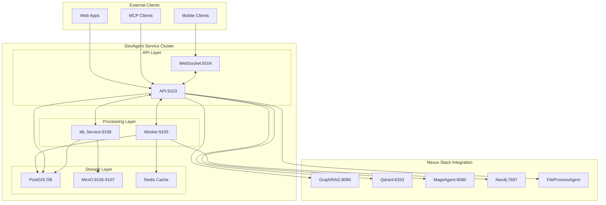
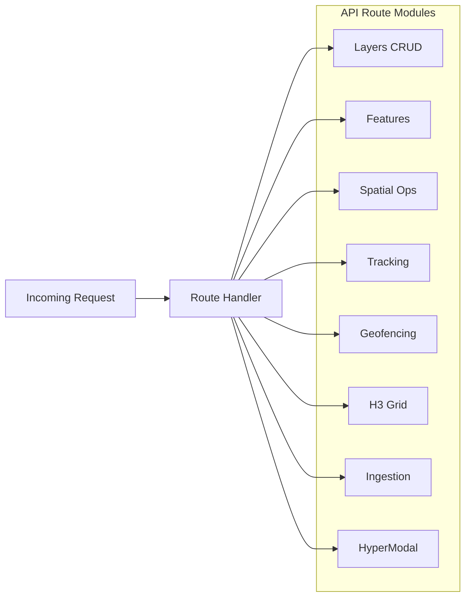
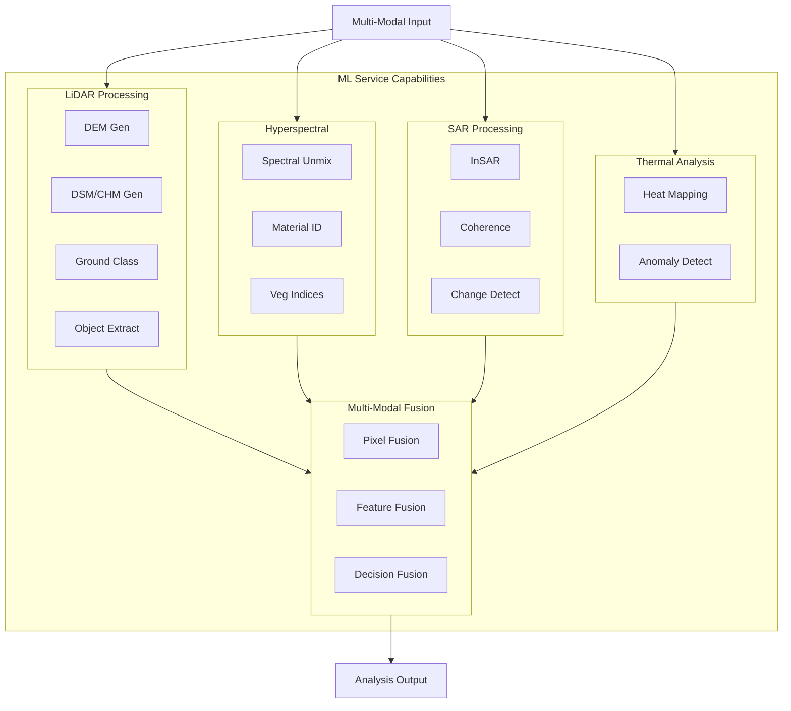
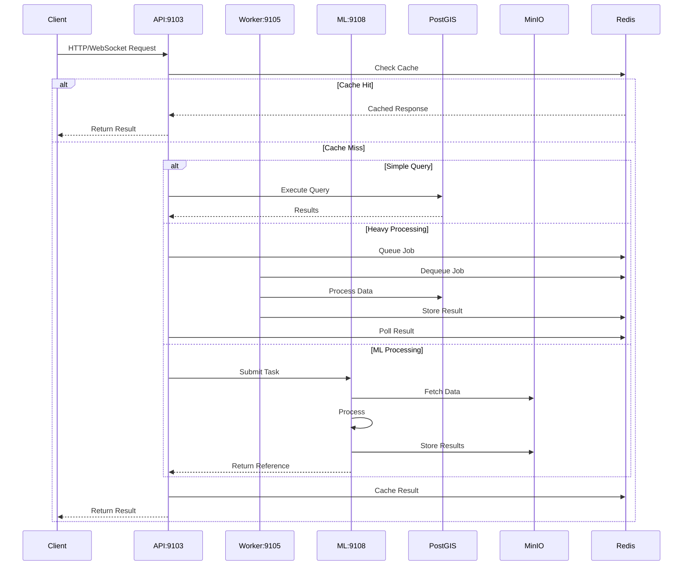
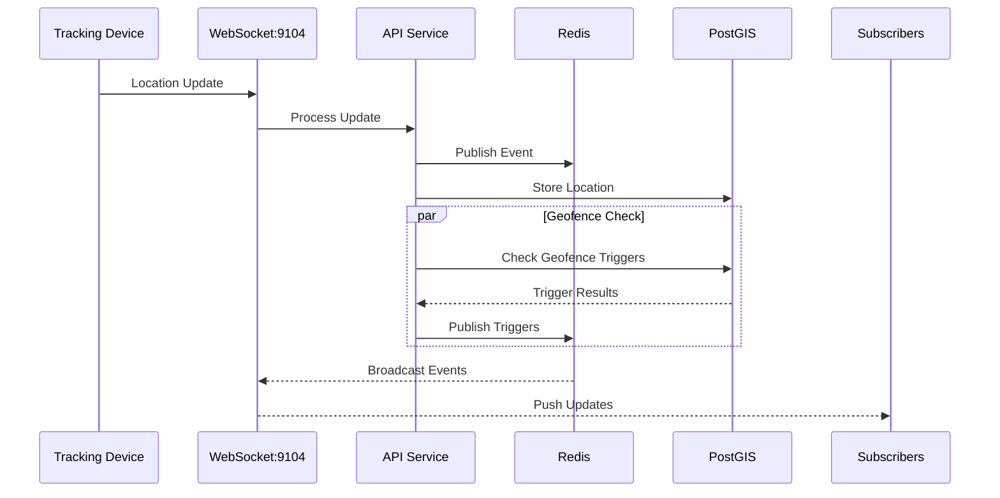
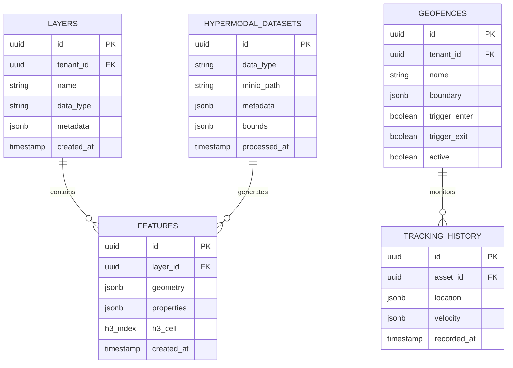
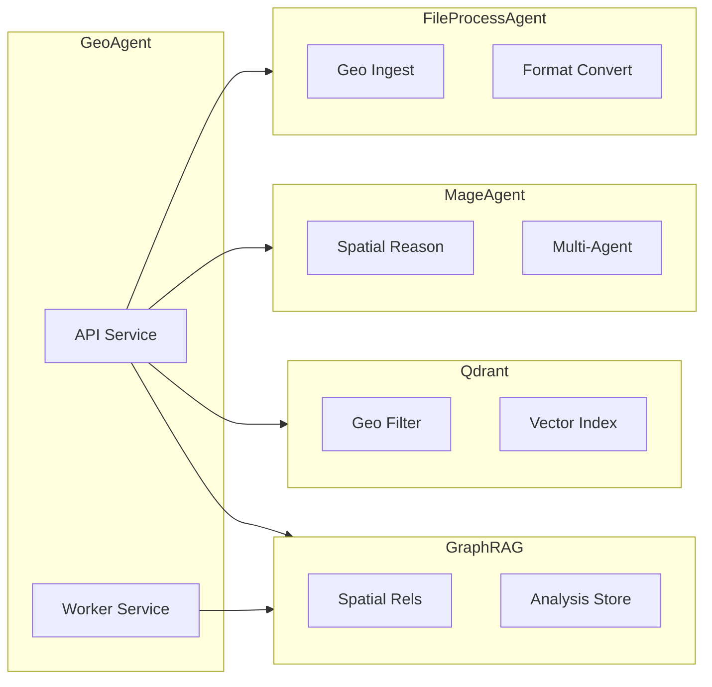
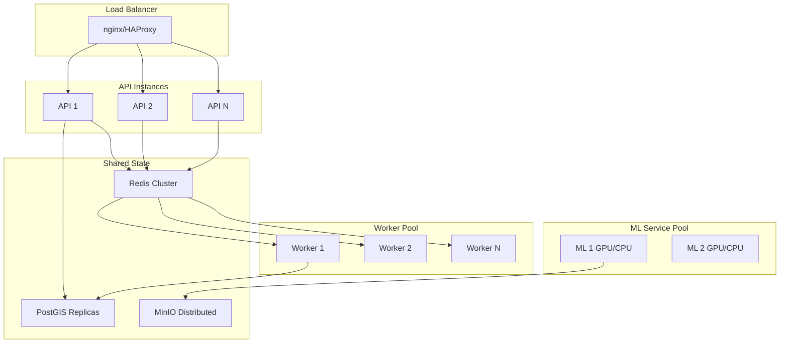
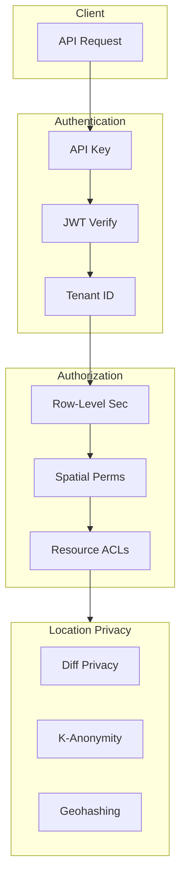

# GeoAgent Architecture

## System Overview

GeoAgent is a comprehensive geospatial intelligence plugin for the Nexus marketplace, providing spatial operations, real-time tracking, and advanced multi-modal processing capabilities. The architecture follows a microservices pattern with clear separation of concerns across three primary services.

## Component Architecture

### API Service (TypeScript)

The API Service serves as the primary entry point for all client interactions, handling HTTP requests, WebSocket connections, and routing to appropriate processing services.

**Port:** 9103 (HTTP), 9104 (WebSocket)

**Responsibilities:**
- REST API endpoint management across 8 route modules
- WebSocket event streaming with sub-50ms latency
- Request validation and authentication
- MCP tool interface (22 tools total)
- Multi-tenancy support with row-level security

**Technology Stack:**
- Runtime: Node.js with TypeScript
- Framework: Express.js or Fastify
- WebSocket: Socket.IO
- Validation: Zod or Joi schemas

### Worker Service (Go)

The Worker Service handles computationally intensive spatial processing tasks asynchronously, enabling the API to remain responsive under heavy loads.

**Port:** 9105

**Responsibilities:**
- Asynchronous job processing via Asynq queue
- Spatial calculations and geometric operations
- Batch feature processing
- Trajectory analysis
- H3 grid aggregation

**Technology Stack:**
- Language: Go
- Job Queue: Asynq (Redis-backed)
- Spatial Libraries: S2 Geometry, H3-go

### ML Service (Python/PyTorch)

The ML Service provides advanced multi-modal geospatial processing capabilities, including LiDAR, hyperspectral, SAR, and thermal analysis.

**Port:** 9108

**Responsibilities:**
- LiDAR point cloud processing (DEM/DSM/CHM generation)
- Hyperspectral analysis and spectral unmixing
- SAR interferometry and change detection
- Thermal anomaly detection
- Multi-modal data fusion

**Technology Stack:**
- Language: Python 3.10+
- ML Framework: PyTorch
- Geospatial: GDAL, Rasterio, PDAL
- Scientific: NumPy, SciPy, scikit-learn

## Data Flow Architecture

### Request Processing Flow

### Real-time Tracking Flow

## Storage Architecture

### PostGIS Database Schema

The database uses JSONB geometry storage with optional PostGIS extensions for advanced spatial operations.

### MinIO Object Storage

MinIO provides scalable storage for large geospatial files that are impractical to store in the database.

**Ports:** 9106 (API), 9107 (Console)

**Bucket Structure:**
- `geoagent-lidar/` - LAS/LAZ point cloud files
- `geoagent-spectral/` - HDF5/ENVI hyperspectral data
- `geoagent-thermal/` - Thermal imagery
- `geoagent-sar/` - SAR data products
- `geoagent-outputs/` - Processed results (GeoTIFF, derivatives)

## Integration Architecture

### Nexus Stack Integration Points

### Integration Details

**GraphRAG (Port 8090)**
- Stores spatial relationships between entities
- Enables knowledge graph queries with spatial context
- Supports HyperModal analysis result storage

**Qdrant (Port 6333)**
- Geo-filtered semantic search
- Spatial vector indexing for similarity queries
- Location-aware document retrieval

**MageAgent (Port 8080)**
- Spatial reasoning capabilities for AI agents
- Multi-agent geospatial coordination
- Location-aware task execution

**FileProcessAgent**
- Geospatial file format ingestion
- Format conversion (GeoJSON, KML, Shapefile, GPX, CSV)
- Coordinate system transformation

## Scalability Architecture

### Horizontal Scaling Strategy

### Scaling Considerations

**API Service Scaling:**
- Stateless design enables horizontal scaling
- Session state maintained in Redis
- WebSocket connections managed via Redis pub/sub

**Worker Service Scaling:**
- Asynq queue supports multiple workers
- Job distribution handled automatically
- Designed for concurrent spatial operations

**ML Service Scaling:**
- GPU acceleration for LiDAR and spectral processing
- Supports CPU-only deployment with reduced performance
- Job-based scaling based on processing queue depth

**Database Scaling:**
- Read replicas for query distribution
- GIST spatial indexes for query performance
- Connection pooling recommended

## Security Architecture

### Authentication and Authorization

### Security Layers

**Transport Security:**
- HTTPS/TLS for all production traffic
- WSS for WebSocket connections
- Certificate management via Let's Encrypt

**Authentication:**
- API key authentication for service-to-service
- JWT tokens for user sessions
- Multi-tenant isolation

**Authorization:**
- Row-level security in PostgreSQL
- Spatial permission boundaries
- Resource-level access control lists

**Location Privacy:**
- Differential privacy for aggregate queries
- K-anonymity for location sharing
- Geohashing for approximate locations
- Configurable precision levels

### Audit and Compliance

- Comprehensive audit logging
- Location access tracking
- Data retention policies
- GDPR compliance support

## Technology Stack Summary

| Component | Technology | Purpose |
|-----------|------------|---------|
| API Service | TypeScript, Node.js | REST API, WebSocket handling |
| Worker Service | Go | Async spatial processing |
| ML Service | Python, PyTorch | Multi-modal analysis |
| Database | PostgreSQL + PostGIS | Spatial data storage |
| Object Storage | MinIO | Large file storage |
| Cache/Queue | Redis | Caching, job queue |
| Spatial Index | Uber H3 | Hexagonal grid indexing |
| Vector Search | Qdrant | Geo-filtered similarity |
| Knowledge Graph | Neo4j, GraphRAG | Spatial relationships |

## Port Reference

| Service | Port | Protocol | Description |
|---------|------|----------|-------------|
| API Service | 9103 | HTTP | REST API endpoints |
| WebSocket | 9104 | WS | Real-time event streaming |
| Worker Service | 9105 | HTTP | Metrics and health |
| MinIO API | 9106 | HTTP | Object storage API |
| MinIO Console | 9107 | HTTP | Web-based management |
| ML Service | 9108 | HTTP | ML processing API |

## Deployment Considerations

### Container Resources

**API Service:**
- Memory: 512MB - 1GB
- CPU: 0.5 - 1 core
- Scales horizontally

**Worker Service:**
- Memory: 1GB - 2GB
- CPU: 1 - 2 cores
- Scales based on job queue

**ML Service:**
- Memory: 4GB - 16GB
- CPU: 2 - 4 cores (or GPU)
- Optional GPU acceleration

### Health Monitoring

- API Health: GET /health on port 9103
- Worker Metrics: GET /metrics on port 9105
- ML Health: GET /health on port 9108
- MinIO Health: Built-in console monitoring

---

*GeoAgent Architecture - Enabling spatial intelligence across the Nexus ecosystem*